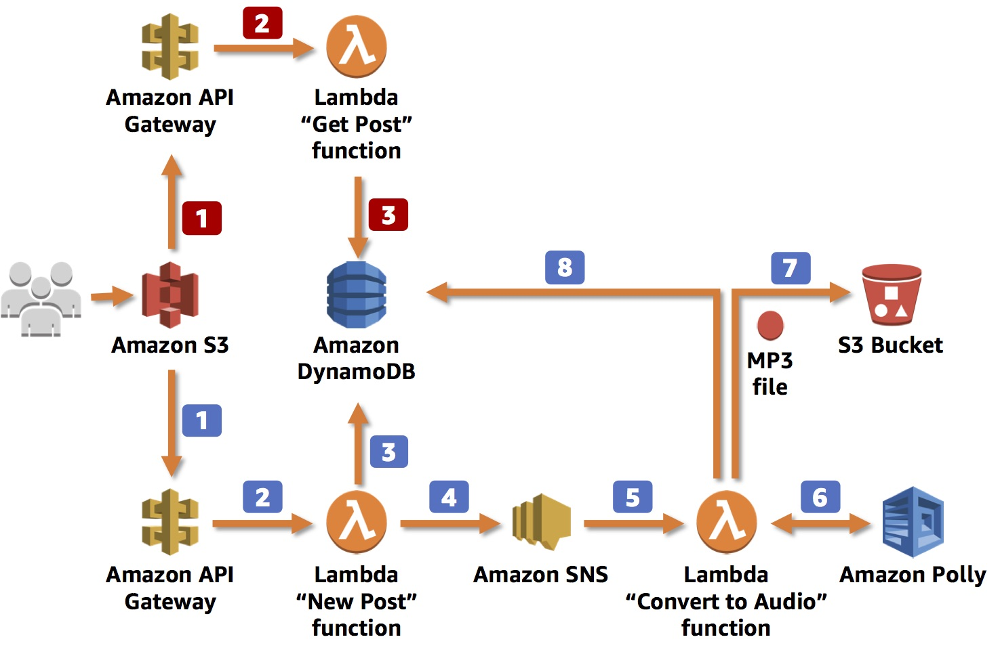

# Text-to-Speech Application
 Text-to-Speech Application With Amazon Polly
## Topics covered
* Create an Amazon DyanmoDB to store data
* Create an Amazon API Gateway RESTful API
* Creeate AWS Lambda function triggered by API Gateway
* Connect AWS Lambda functions with Amazon Simple Notification Service (SNS)
* Use Amazon Polly to synthesize speech in a variety of language and voices

## Application Architecture

### When the application sends information new posts :
1. The information is received by the RESTful web service exposed by **Amazon API Gateway**. This web service is invoked by a static webpage hosted on Amazon Simple Storage Service (**Amazon S3**).

2. Amzaon API Gateway triggers an **AWS Lambda function**, New Post, Which is responsible for initialozing the process of generating MP3 files.

3. The Lambda function inserts information about the post into an **Amazon DyanmoDB table**, where inforamation about all posts is stored.

4. To run the whole process asynchronously, you will use Amazon Simple Notification Service (**Amazon SNS**) to decouple the process of receving information about new posts and staring their audio conversion.

5. Another Lambda function, Convert to Audio, is subscribed to your SNS topic and is triggered whenever a new message appears (which means that a new post should be converted into an audio file).

6. The Convert to Audio Lambda function uses **Amazon polly** to convert the text into an audio file in the specified language (the same as the language of the text).

7. The new MP3 file is saved in a dedicated S3 bucket.

8. Information about the post is updated in the DynamoDB table. The URL to the audio file stored in the S3 bucket is saved with the previously stored data.  

### When the application retrieves information about posts :
1. The RESTful web service is deployed using **Amazon API Gateways**. Amazon API Gateway expose the method for retrieving information about posts. These methods contain the text of the post and the link to the S3 bucket where the MP3 file is stored. The web service is invoked by a **static webpage hosted on Amazon S3**.

2. Amazon API Gateway invokes the Get Post Lambda function, whcich deploys the logic for retreving the post data.

3. The Get Post Lambda function retrieves infromation about the post (including the reference to Amazon S3) from the DyanoDB table and returns the information. 

## Task 1 : Create a DyanmoDB Table
This application will store infromation about blog posts, including the text and URL of the MP3 file in Amazon DyanmoDB.
1. Table name : posts
2. Primery key : id (String)
3. checkbox select : Use default settings

## Task 2 : Create an Amazon S3 Bucket
You also need to create an Amazon S3 bucket to store all audio files created by the application. You will create a bucket with a unique name, such as audioposts-123
1. **Bucket name**: audioposts-NUMBER

   - Replace **NUMBER** with a random number
   - Copy the name of your bucket to your text editor. You will use the bucket name later.

2. **Region**: Do not change the location

3. **Block public access** De-select checkbox

- **Create bucket**

## Task 3 : Create an SNS Topic

- As you probably noticed in the architecture diagram, the logic of converting a post (text) into an audio file will be split into two AWS Lambda functions. This was done for a couple of reasons.

- **First**, it allows the application to use asynchronous calls so that the user who sends a new post to the application immediately receives the ID of the new DynamoDB item, so it knows what to ask for later without having to wait for the conversion to finish. With small posts, the process of converting to audio files can take milliseconds, but with bigger posts (100,000 words or more), converting the text can take a longer. In other use cases, such as real-time streaming, size isn't a problem because Amazon Polly starts to stream speech back as soon as the first bytes are available.

- **Second**, the system uses a Lambda function to convert the posts.

- Given that the process has been divided into two processes, there needs to be a way to integrate them together. You will use **Amazon SNS** to send the message about the new post from the first function to the second function.

1. **Name**: new_posts

2. **Display name**: New posts

3. Copy the **Topic ARN** and paste it into a text editor for later use. It should look similar to:
   - arn:aws:sns:us-west-2:123456789012:new_posts

## Task 4 : Create a New Post Lambda Function

- The first Lambda function you will create is the entry point for the application. It receives information about new posts that should be converted into audio files.

1. On the **Services** menu click **Lambda**

2. Create a new (Author from scratch) function using the following setting:
      
   - **Function name** : PostReader_NewPost
   - **Runtime** : Python 3.7
   - **Expand** : Choose or create an execution role
   - **Execution role** : Use an existing role
   - **Function code** : [PostReader_NewPost.py](https://github.com/Mukundkhunt/Text-to-Speech-Application/blob/master/Document/PostReader_NewPost_Func.py)

3. In addition, the New Post Lambda function needs to know the name of the DynamoDB table and the SNS topic. To provide these values, we use the following environment variables:

   - **SNS_TOPIC** : the Amazon Resource Name (ARN) of the SNS topic we created
   - **DB_TABLE_NAME** : the name of the DynamoDB table (in our case, it’s posts)

- As shown in the following code, this Lambda function does the following:
  1.  Retrieves two input parameters:
      - **Voice** – one of dozens of voices that are supported by Amazon Polly
      - **Text** – the text of the post that we want to convert into an audio file
  2.  Creates a new record in the DynamoDB table with information about the new post

  3. Publishes information about the new post to SNS (the ID of the DynamoDB item/post ID is published there as a message)
  
  4.  Returns the ID of the DynamoDB item to the user

## Task 5 : Create a Convert to Audio Lambda Function
1. On the **Services** menu click **Lambda**

2. Create a new (Author from scratch) function using the following setting:
      
   - **Function name** : ConvertToAudio
   - **Runtime** : Python 3.7
   - **Expand** : Choose or create an execution role
   - **Execution role** : Use an existing role
   - **Function code** : [ConvertToAudio.py](https://github.com/Mukundkhunt/Text-to-Speech-Application/blob/master/Document/ConvertToAudio_Func.py)

3. As with the New Post function, we need to tell this Lambda function which services it can interact with.  To provide these values, we use the following environment variables and values:

   - **DB_TABLE_NAME** : The name of the DynamoDB table (in our case, it’s posts )
   
   - **BUCKET_NAME** : The name of the S3 bucket that we created to store MP3 files

- This Lambda function does the following:

   1. Retrieves the ID of the **DynamoDB** item (post ID) which should be converted into an audio file from the input message (**SNS** event)
   2. Retrieves the item from **DynamoDB**
   3. Converts the text into an audio stream
   4. Places the audio (MP3) file into an **S3** bucket
   5. Updates the **DynamoDB** table with a reference to the **S3** bucket and the new status